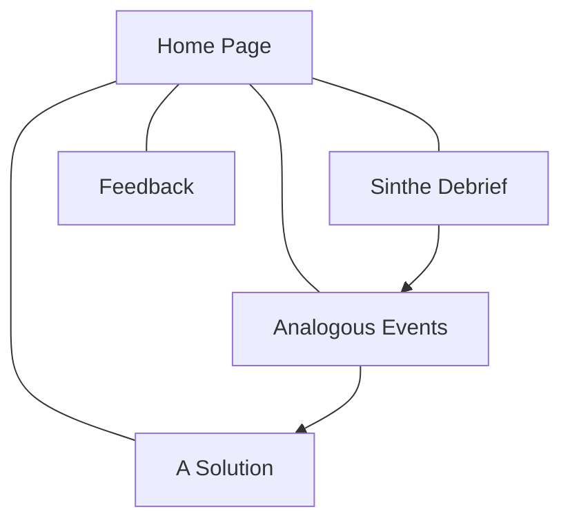

# Considering Sinthe in Context

ITE 170 Multimedia Software Project

## Purpose

This website will be presenting a public health plan for the Sinthe abuse crisis to _Genshin Impact_'s Court of Fontaine based on historical drug crises in the United States. It will have pages explaining the fictional Sinthe crisis, some real-world drug crises in the United States, and a possible solution centered around public health.

## Todos

- [x] Convert all banner images to responsive `<picture>` elements with multiple different sizes
- [ ] Add more to `solution.html` based on articles (may include the following)
    - [Withdrawal Symptoms overview](https://www.ncbi.nlm.nih.gov/books/NBK459239/)
    - [Naltrexone for treating alcohol addiction](https://www.ncbi.nlm.nih.gov/pmc/articles/PMC4781804/#CR15)
    - [In-depth analysis of IV extended-release naltrexone](https://nyaspubs.onlinelibrary.wiley.com/doi/10.1111/j.1749-6632.2010.05900.x)
- [ ] Format blockquotes

## Sitemap

